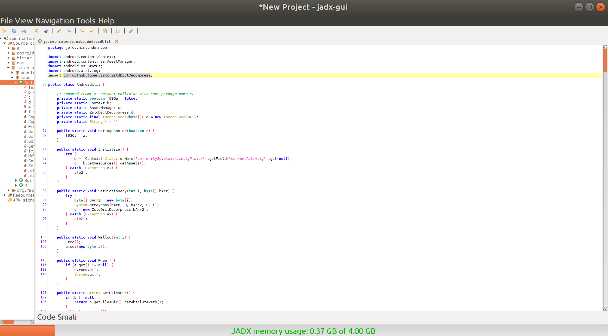

# Reverse Engineering Mario Kart Tour on Android

I found these [cool looking graphs](https://www.reddit.com/r/MarioKartTour/comments/f304jv/tier_list_of_all_charactes_in_mario_kart_tour/) on which driver is best in [reddit/r/MarioKartTour](https://www.reddit.com/r/MarioKartTour) by [HGProductions00](https://www.reddit.com/user/HGProductions00/).


They were done by hand, as in, extracting all the game data necessary to compute
which are the best drivers by looking at the game and writing them down in, say,
a spreadsheet.

I also found out other people did similar things (like [amazingly complete blog articles](https://www.imore.com/every-vehicle-confirmed-mario-kart-tour)) again, by hand.

This seemed way too tiresome, there must be a better way I thought. I also
wondered why Nintendo is not providing this data for gamers to use. It's not
like anyone will be hurt by it and big fans will love it. Or so I think! They must have a busy agenda.
The game seems to be doing pretty well.

So I went into the innocent adventure of trying to find some kind of table in the datafiles
of the game that relates
drivers with races. And also karts and gliders, but, we should start somewhere. Note that
I don't pretend to do anything else with this than finding that and learning on the way.

I hope I don't upset anyone :)

# Obtaining the APK
A quick search can easily find the latest APK. Or even an older one.

For example, I found the latest as the time of writing [1.6.0 at apkaward](https://apkaward.com/mario-kart-tour).

And, for reasons we will soon see, also version [1.0.2 at apkgoogle](https://apkgoogle.org/games/mario-kart-tour-v-1-0-2-full-apk/).

# Dissassembling the APK
APK files are just .zip files for Android projects.

One can just unzip it and check what is inside.

```bash
mkdir unzipped
cd unzipped
unzip ../com.nintendo.zaka_1.6.0-APK_Award.apk
```

This gives us a set of typical folders in an android project (res, assets...):

```bash
AndroidManifest.xml                 firebase-iid-interop.properties                 play-services-auth-base.properties         play-services-nearby.properties
assets                              firebase-iid.properties                         play-services-auth.properties              play-services-safetynet.properties
classes.dex                         firebase-measurement-connector-impl.properties  play-services-basement.properties          play-services-stats.properties
com                                 firebase-measurement-connector.properties       play-services-base.properties              play-services-tasks.properties
firebase-analytics-impl.properties  firebase-messaging.properties                   play-services-drive.properties             res
firebase-analytics.properties       lib                                             play-services-games.properties             resources.arsc
firebase-common.properties          play-services-ads-identifier.properties         play-services-measurement-api.properties
firebase-core.properties            play-services-auth-api-phone.properties         play-services-measurement-base.properties
```

But we can do even better than that.

Using [jadx-gui](https://github.com/skylot/jadx), for example as there are others, we can also get a readable version of the pieces of the code
that can be reversed into Java code. Otherwise they will be in smali. Which is
like the byte code of the Dalvik Virtual Machine used in Android. In this case we will get a mix.

It looks like this:



# Looking around
We found an interesting (and very standard) folder called `assets`. Inside there is a folder called `_nabe_`. Not that standard. Inside that folder we find A LOT of files ending the filename with `.zst`. 380 files to exact.

# zst files
I never heard about zst files but a bit of looking on the internet gets us to 
a compressed file format. Using the [real-time compression algorithm Zstandard](https://facebook.github.io/zstd/).

Trying to uncompress them straight away doesn't work.
```bash
sudo apt-get install zstd
unzstd fdda0fb0-7210d730.zst
# Output:
dda0fb0-7210d730.zst : Decoding error (36) : Dictionary mismatch
```

We need some kind of dictionary.

Looking around in Github I found a zst dictionary for 1.0.2 (`1.0.2.zdict`). I checked if it worked.
It did!

```bash
unzstd -D 1.0.2.zdict fdda0fb0-7210d730.zst
fdda0fb0-7210d730.zst: 2391 bytes
```

Now I can check around what's inside of the zst files. I extracted them all.
```bash
mkdir uncompressed && cd uncompressed
unzstd -D 1.0.2.zdict ../*.zst
```

First I did `strings` and `xxd` to check out manually the strings found in these files.
I found some words that were familiar. Some track names, character names, glider names... spread around but quite garbled.

```bash
# Do 'strings' on every file and concatenate them all together in one file
mkdir strings && cd strings
strings ../* > all_strings.txt
```
I opened that with Sublime Text and just looked around.

I also did `xxd` on all the files in another folder by making a Python script.
```bash
mkdir hexdumps && cd hexdumps
# print all the filenames in a row to paste in the python script
ls -1 | xargs echo
```

```python
#!/usr/bin/env python
import os

file_list = "005b164a-c938403c 008b1b5f-21ad8683 00920339-ba955592 01896112-9ae8a9f5 020e17f3-b130602f 02c0359a-c10ed6d7 03614319-8a527c97 036b7c81-a040ed92 03784c09-765055b5 06b35cbd-a41038e6 06e36c50-753725ab 06e6a0da-d2ae82ff 07e7688e-9ac10971 08f875af-f5b2fcea 0a7dd002-5646c7d6 0a8ef01e-cb897f5c 0aea8342-4617727f 0bcf14bb-8907a89b 0bd78150-5e6efd2b 0bfdcb9a-f30623c6 0c44ed34-ae99732c 0cd7d127-e999c4a8 0de19966-67a25ff6 0e59ea66-daebb5bf 0ea2858d-627abd60 0f62c0ea-76b39317 0f8af36a-65782075 10449850-4fd54a44 1072b778-5b0b7a1d 110154f0-42045f39 115c27bf-efacf6c7 1197ea9d-99527348 12144322-4a4f9135 12622068-f18ac7ac 12d8994a-80023c44 13d4338c-d00a85b0 14316f31-6c7cfd02 1435f80b-9a5eaead 156cd381-d92927ee 15b65a65-303197a7 163055c4-405d17a3 16952777-b0e2f408 16ec6951-d66aeedb 17e23f88-cfddf741 18355902-407e125e 185fd5a0-a66b4edb 18cf483b-c1b0910e 196685e3-eb5929e5 19a876f2-1cbc49c1 1ae95bb7-4b03d768 1b878269-162e5048 1c859672-2910ef1b 1c8f97b5-4c954b66 1c951f3a-e3165efc 1d608fed-cc152f4b 1e5ddf41-ba04f85d 1f2f103a-4f1c7c70 1fbb13cd-9b2b7316 20f17045-1a6deac0 20f2b161-b1454a2f 214fb1ef-05ad70dd 21bdb43c-18f1d1e4 21ee64cd-4feff55a 22d145ad-c55d8c34 24ed886d-403e3047 25cb01e5-d293f25f 25d0a866-bebaef83 261a788d-b56b1bb1 2656cb6d-2a97eaf4 26624eeb-3ac908ec 26f8e2d2-a2d8276a 28340725-14526630 287e7e3d-5d39ba23 2881ded6-8b1f5bd4 2972482c-ea273a6f 2afba8dd-4884e4a4 2b0df89f-5eef4115 2b4ab878-3b50189e 2b8ccce3-2e7a6507 2c13d6a7-6e9d9743 2d02405e-c99a5bb1 2d8852bc-5ba2be68 2df57d41-e7a25d6a 2e4cc33c-9ab7d93e 2e570628-88759a91 2e905c4a-ef05ffff 2eabfd9a-121c57df 2f83d40b-c8f922ba 2fcd21a6-560e1a87 300037c7-defdd250 306a0252-bd17ce38 306f24f8-37e80169 3195d64c-12e8dbed 333efcd3-7c722ddc 3483df6a-32750fc2 349f34d7-8344bf5e 358b8f5c-fa940085 36e3fc26-7b52eb49 375fbb6f-abb676d8 3824c430-1af829bf 38416ad5-9b3d4dd4 38ad9344-cc9e7eea 391ea8c5-82afd0c6 397592f9-b1dcc933 3ab23916-5da40941 3b151acc-777c4bff 3c938ef7-08781425 3cad1134-b1d1a25d 3cd8cc00-05df9a64 3d2c9d4f-a3b79a44 3dc3027e-386226d7 3dff073d-c0564e96 3e12aae6-feef4e3d 3f804ad8-a0cab522 4067f66b-19671a9a 40aa56c9-71f7500d 439297ae-c71aee9e 43f8bf05-72de2072 450a57a3-484cd0d1 460580b2-34bf67e3 48145714-462c925f 499ba41c-1372d090 4b5fd154-2ace99d1 4c21637b-b2dda63d 4c5a9c74-f3940ffb 4c7f87c5-8a079942 4d4a12f5-fe53a8cb 4d4f5181-8a0837cf 4d68f24e-07c2ddbb 4d80f3aa-9e3f3f5a 4da53bf2-cb8e0f95 4e3e855d-f5508364 4e596fa1-e12ed106 5061e740-2f5e4477 509d06e5-87513ef8 50c6a134-820f45a7 513a7a7e-2ae3f2bc 5209860e-8f31dc43 5233e6dc-652471d0 52ee2574-c63dd8b6 53124eb4-17224c7e 5312aaf0-65295350 545040a8-0b688515 54efc718-0b271a50 550cdfd2-5afa6d25 56fa7b8f-eb949d70 57a8a8c2-b5fed251 58183a05-fb64e54b 58953ebc-760bae89 58ede6e6-64317c62 5ac18bc0-ca8e4c07 5ac2791a-3912786f 5b775b79-e85874bb 5c1edbc3-7ca0f4e8 5d1d3cc1-2c116e73 5e04372b-3e0a48a5 5e6e9857-2819cd56 5f390580-650cf0d9 62f9b4a7-37720696 631cedfd-7620897c 640cfd37-959a4de1 6451d014-ff3b7db4 6607ac82-87a43147 66f2a7ad-f3e66b90 68218694-4b10b439 68a6425c-657e2d55 690067e2-a9961dc5 694b0c45-733d4e75 69ce4dfa-89d4870f 6a21d09f-89a33abb 6b8e9666-2d6ea0a9 6bf5f00a-7a903d49 6c2406e5-8044b530 6c3cc59a-6d02da60 6c6d55a1-ea9bebd2 6ce9a66e-6e022f44 6e4dff55-df4ac1e5 6e680914-e7401198 6e930777-4bd11fd7 6f0614d6-92446550 6f6ca06c-5f1435de 7065e907-8dfee1c6 70aa2829-0160ce6c 71b876b5-b6320273 722fdd45-d1fe50aa 7260db4e-51956643 7363e80a-4863ed71 73819d7f-06a604dc 753e5410-72af1fb5 761c6a8b-f5e97f61 77383bc4-bf5ce142 77d5e0b1-9a1ecb08 7a5fe76f-243ff29d 7ab18a44-e46bd5bc 7b0bfc37-1f0becba 7ba99112-0e05e3e6 7bd359f7-b77fb948 7bf6d2de-35d8f3a8 7c77b28a-3a51ac8a 7c934c56-a9107070 7cc5a4ad-2357be9e 7f7e30a9-183f1bdb 82128efc-fbb3d51d 8218257d-88bc3271 834ebd08-75bc60d4 83c87fa0-0baa8570 83c94c70-a81ea91e 83da0b82-250f829c 85bd02b2-3efe1a43 86abfba6-387be57e 870092d8-e36da373 870508c1-823f3331 872c989d-13a0ae06 879f02cb-1fbc75cf 87cae641-2924ece7 88913b6c-1cad5911 890b72cd-b8ba3613 897b0df3-9fe9ed45 8992ee6b-29182d82 8a113d25-2e11b936 8b398854-196a5d6d 8b7917d9-abd26b4f 8d3c5f39-cd5a86ff 8d3d3c5d-76e29534 903ad161-6af87a69 9115fb99-bc634b43 92c6916e-0c06257f 92d75c39-350ae2b8 949a75a5-719ef002 955c3fe3-b9b291cc 95eca1fd-87de34a9 961490d1-b02b51b3 9718757c-f5fae626 97813bfb-3c660b19 9807ea1b-d99d8a2e 986acf26-2bbc1388 995d2d01-2335bdf3 9a4d1812-0b8cefbc 9a7306e0-34f1eb6d 9a7c1748-daa08440 9a7e88b8-2ce201a6 9b986842-6bb3e593 9bc5b2db-5ceb4bb9 9d366eff-254561ad 9ddfd43f-d80e0a96 9dff13a6-af1cf27c a0530c4a-242a313f a07d3bb9-68e50546 a1644b68-f5ba930f a19e832f-7fdff502 a1b8336a-7a903d49 a2975c1d-0ec566b6 a3482ee4-6cdc01c7 a47d49c7-a9e60617 a50c9681-768acf1b a5e8183b-f2849fbb a651ffcb-636d79d6 a665e890-7e968bd1 a709bf68-32311033 a7b79e17-fc74465e a7c161b0-92f0719f a8e16401-4335e7a4 a9bbcd69-7e769899 a9e26c6c-3de78bbf a9fb1eff-d0883c91 aa2da720-68f91400 ab9717dd-8d2432fd aca92967-2c4b1f36 ad44e067-11e7c16d af1c6cd3-b7fba14d af50f678-35754cbb b17c70b0-dfbd806f b264f946-3e38d0c6 b2955d44-ea38ede0 b2b308de-2f635710 b2cfd600-1c575d30 b2f43658-1b3f9689 b36bd618-7797dc4d b3abdc84-9b75bd2a b4a07d52-69175762 b4f66c48-9567cb4a b678cc3c-972f68a5 b724c995-ac6aa3f2 b7b6dc69-3f661e30 b87e8385-e3c0cf17 ba3dd53a-8ed23004 ba7fd5c9-5ddda958 bb08ae53-7cf1462b bb21e888-942b9b05 bb88797b-3becf2e8 bcdd055a-d0188458 bd7a883e-5fc0d290 bd7da6e7-659fe143 be889528-8df0dc82 beec1a6a-3a316e55 bf2207bc-4ea18c93 c281fcf8-06088abf c319e6b9-7cbe4667 c386a13f-95bb6e04 c3de92cb-cbb8fd6a c502e68a-236798d6 c5a6439d-246dd813 c5e4468d-5124bb3b c6343018-9456daab c7d3db5f-66c0306c c8cb20ed-872aa80e c934870e-b1510a05 c99b3fd4-d08a225b c9b4ac1f-fe881799 cae486ad-97d93ea7 cb23edba-2dc7b720 ccef668b-373b47e4 cddf5715-e385dc7b ce883350-cc570c12 cf2d34a9-d0ccf2c0 d070cf43-cdc7b7fc d22c22d2-29aee8e8 d251ee5a-860fcd1d d2cce591-a4648d99 d49109bf-a7d62a21 d529a3ff-2e5190cd d5d4d32c-7c296595 d77fb5c7-0f49fcfe d7fd6a4c-4c594c42 d8232deb-fc6f6432 d8c407d6-ffefe9fa d9607e71-7a903d49 da7ccffe-29a892e4 db222175-068bb6af dba16a15-be344c82 dc455216-ac6448c1 dc61155c-0adf01f8 dc726b48-84b336d9 dc9cb233-c5645c9b dca55745-1b791038 dd1a7c75-c3490277 de73c50f-ec9afd52 deeb0d06-e815f552 e0eda44a-4c18a6c7 e1c75a3f-b9827570 e22b611e-6d60178d e2aff946-50d2669e e2ee8eea-95d83041 e2fd7bbf-9aa63f42 e32d1f6e-50b9f5f3 e3d6c995-cda20be6 e3e84947-e85f740e e46c6d16-8cbe0d66 e5847386-e00b67b0 e590538d-db39bc87 e60549cf-21fb1e63 e63bab63-8de621d3 e6fc3bdc-9de8481c e7c992ee-5b38bcee e88fecd9-dd3abd3a ea54e4a1-7ed722a9 ebb62c33-16df2e74 ec3e031f-5daf9d83 ec5c7f61-f1a210ed ed937a86-af18dc23 ee28917b-c02b952a f0da5195-941b8a46 f13ee596-711921c5 f14376b5-9034dda8 f3426d46-7d1940b9 f53823b3-76566690 f58136e3-b0597bb8 f651aebe-d967415b f6a26679-35c44751 f7b26dc0-6ab5ccc5 f80b3ca5-1e732db1 f8322a43-967b8501 f894827a-1abaf081 f9c744d1-afb16572 fb19e754-e9ab6340 fb20f2f2-f1fbbfcc fc8da05d-ea8c6b81 fdda0fb0-7210d730 fed5826b-02077aca"
file_list = file_list.split(' ')
for f in file_list:
    os.system("xxd ../" + f + "> " + f + ".hex")
```

I kept investigating while making a Python script to ease the task. I ran it on the strings folder.

```python
#!/usr/bin/env python
import os

non_unity_fs_files = []
unity_fs_files = []
for filename in os.listdir('.'):
    if filename.endswith(".txt") and filename != "all_strings.txt":
        with open(filename, 'r') as f:
            print(filename + " is: ", )
            if "UnityFS" in f.read():
                unity_fs_files.append(filename)
                print("UnityFS")
            else:
                non_unity_fs_files.append(filename)
                print("Something else")

print("Got " + str(len(unity_fs_files)) + " unityfs files:")
print(unity_fs_files)


print("Got " + str(len(non_unity_fs_files)) + " non unityfs files:")
print(non_unity_fs_files)


button_files = []
non_button_files = []
for filename in non_unity_fs_files:
    with open(filename, 'r') as f:
        if "MsgStdBn" in f.read():
            button_files.append(filename)
        else:
            non_button_files.append(filename)

print("From the non unityfs files files are:")
print("Got " + str(len(button_files)) + " MsgStdBn files")
print(button_files)


print("Got " + str(len(non_button_files)) + " non MsgStdBn files")
print(non_button_files)

akpkd_files = []
non_akpkd_files = []
for filename in non_button_files:
    with open(filename, 'r') as f:
        if "AKPKD" in f.read():
            akpkd_files.append(filename)
        else:
            non_akpkd_files.append(filename)
print("From these, the files may be:")

print("Got " + str(len(akpkd_files)) + " AKPKD (packed BNK) files")
print(akpkd_files)

riff_files = []
non_riff_files = []
for filename in akpkd_files:
    with open(filename, 'r') as f:
        if "RIFF" in f.read():
            riff_files.append(filename)
        else:
            non_riff_files.append(filename)

print("From these " + str(len(riff_files)) + " contain RIFF files inside")
print("And " + str(len(non_riff_files)) + " dont contain RIFF")
print(non_riff_files)


print("Got " + str(len(non_akpkd_files)) + " non AKPKD files")
print(non_akpkd_files)

print("They seem to be completely binary")


# Got 339 unityfs files:
# ['8992ee6b-29182d82.txt', '460580b2-34bf67e3.txt', '306a0252-bd17ce38.txt', '5ac18bc0-ca8e4c07.txt', '2c13d6a7-6e9d9743.txt', '1b878269-162e5048.txt', '890b72cd-b8ba3613.txt', '439297ae-c71aee9e.txt', '545040a8-0b688515.txt', '28340725-14526630.txt', '9718757c-f5fae626.txt', '3cad1134-b1d1a25d.txt', '12d8994a-80023c44.txt', '2e4cc33c-9ab7d93e.txt', '450a57a3-484cd0d1.txt', 'c502e68a-236798d6.txt', '52ee2574-c63dd8b6.txt', '5c1edbc3-7ca0f4e8.txt', 'a5e8183b-f2849fbb.txt', '3dff073d-c0564e96.txt', '8b7917d9-abd26b4f.txt', '3e12aae6-feef4e3d.txt', '550cdfd2-5afa6d25.txt', '87cae641-2924ece7.txt', '12144322-4a4f9135.txt', '185fd5a0-a66b4edb.txt', 'c9b4ac1f-fe881799.txt', '4c5a9c74-f3940ffb.txt', 'c386a13f-95bb6e04.txt', 'e590538d-db39bc87.txt', '15b65a65-303197a7.txt', '834ebd08-75bc60d4.txt', '2afba8dd-4884e4a4.txt', '82128efc-fbb3d51d.txt', '1fbb13cd-9b2b7316.txt', '9bc5b2db-5ceb4bb9.txt', '0ea2858d-627abd60.txt', 'cb23edba-2dc7b720.txt', '18355902-407e125e.txt', 'e5847386-e00b67b0.txt', '77d5e0b1-9a1ecb08.txt', '870508c1-823f3331.txt', 'b36bd618-7797dc4d.txt', '8d3d3c5d-76e29534.txt', '961490d1-b02b51b3.txt', '16ec6951-d66aeedb.txt', '21bdb43c-18f1d1e4.txt', 'fdda0fb0-7210d730.txt', 'bd7a883e-5fc0d290.txt', 'b7b6dc69-3f661e30.txt', '25cb01e5-d293f25f.txt', '1ae95bb7-4b03d768.txt', '10449850-4fd54a44.txt', '4e596fa1-e12ed106.txt', 'b2f43658-1b3f9689.txt', 'db222175-068bb6af.txt', '58953ebc-760bae89.txt', 'e46c6d16-8cbe0d66.txt', '03784c09-765055b5.txt', 'dca55745-1b791038.txt', '955c3fe3-b9b291cc.txt', '7f7e30a9-183f1bdb.txt', '306f24f8-37e80169.txt', '50c6a134-820f45a7.txt', 'e3d6c995-cda20be6.txt', '9dff13a6-af1cf27c.txt', '4e3e855d-f5508364.txt', '5312aaf0-65295350.txt', '640cfd37-959a4de1.txt', 'aa2da720-68f91400.txt', 'beec1a6a-3a316e55.txt', '9a7306e0-34f1eb6d.txt', '897b0df3-9fe9ed45.txt', 'a7b79e17-fc74465e.txt', '26624eeb-3ac908ec.txt', '6b8e9666-2d6ea0a9.txt', '6c2406e5-8044b530.txt', '0bd78150-5e6efd2b.txt', 'b17c70b0-dfbd806f.txt', '156cd381-d92927ee.txt', 'bb08ae53-7cf1462b.txt', 'c6343018-9456daab.txt', '06e6a0da-d2ae82ff.txt', '22d145ad-c55d8c34.txt', '83c94c70-a81ea91e.txt', '4b5fd154-2ace99d1.txt', 'a709bf68-32311033.txt', 'deeb0d06-e815f552.txt', '38416ad5-9b3d4dd4.txt', 'de73c50f-ec9afd52.txt', 'e22b611e-6d60178d.txt', 'a9fb1eff-d0883c91.txt', '0de19966-67a25ff6.txt', '58183a05-fb64e54b.txt', 'd070cf43-cdc7b7fc.txt', '7c77b28a-3a51ac8a.txt', 'a47d49c7-a9e60617.txt', '6f0614d6-92446550.txt', 'f9c744d1-afb16572.txt', 'f80b3ca5-1e732db1.txt', 'c319e6b9-7cbe4667.txt', '9807ea1b-d99d8a2e.txt', '509d06e5-87513ef8.txt', '2fcd21a6-560e1a87.txt', '349f34d7-8344bf5e.txt', 'ebb62c33-16df2e74.txt', '287e7e3d-5d39ba23.txt', 'ed937a86-af18dc23.txt', 'b264f946-3e38d0c6.txt', '3195d64c-12e8dbed.txt', '66f2a7ad-f3e66b90.txt', 'bf2207bc-4ea18c93.txt', '92c6916e-0c06257f.txt', '62f9b4a7-37720696.txt', 'e1c75a3f-b9827570.txt', '196685e3-eb5929e5.txt', 'dd1a7c75-c3490277.txt', 'a9e26c6c-3de78bbf.txt', 'c281fcf8-06088abf.txt', '9ddfd43f-d80e0a96.txt', 'e2ee8eea-95d83041.txt', 'dc726b48-84b336d9.txt', '872c989d-13a0ae06.txt', '6c6d55a1-ea9bebd2.txt', 'b4a07d52-69175762.txt', '17e23f88-cfddf741.txt', 'e2aff946-50d2669e.txt', '38ad9344-cc9e7eea.txt', '6ce9a66e-6e022f44.txt', 'dba16a15-be344c82.txt', '4d80f3aa-9e3f3f5a.txt', '6e680914-e7401198.txt', '40aa56c9-71f7500d.txt', 'b4f66c48-9567cb4a.txt', '13d4338c-d00a85b0.txt', '722fdd45-d1fe50aa.txt', '58ede6e6-64317c62.txt', '397592f9-b1dcc933.txt', 'd49109bf-a7d62a21.txt', '2b0df89f-5eef4115.txt', 'e88fecd9-dd3abd3a.txt', 'bb88797b-3becf2e8.txt', '2972482c-ea273a6f.txt', 'f6a26679-35c44751.txt', '01896112-9ae8a9f5.txt', '70aa2829-0160ce6c.txt', '4d4a12f5-fe53a8cb.txt', 'f0da5195-941b8a46.txt', '2881ded6-8b1f5bd4.txt', '1e5ddf41-ba04f85d.txt', 'bd7da6e7-659fe143.txt', 'aca92967-2c4b1f36.txt', 'c5e4468d-5124bb3b.txt', '02c0359a-c10ed6d7.txt', '1435f80b-9a5eaead.txt', '8b398854-196a5d6d.txt', '4da53bf2-cb8e0f95.txt', '7c934c56-a9107070.txt', 'a7c161b0-92f0719f.txt', '3ab23916-5da40941.txt', '83c87fa0-0baa8570.txt', 'b678cc3c-972f68a5.txt', 'f7b26dc0-6ab5ccc5.txt', '68a6425c-657e2d55.txt', 'af50f678-35754cbb.txt', '19a876f2-1cbc49c1.txt', '56fa7b8f-eb949d70.txt', '694b0c45-733d4e75.txt', '9b986842-6bb3e593.txt', '0f62c0ea-76b39317.txt', 'b2955d44-ea38ede0.txt', 'a2975c1d-0ec566b6.txt', '57a8a8c2-b5fed251.txt', '12622068-f18ac7ac.txt', '21ee64cd-4feff55a.txt', 'cddf5715-e385dc7b.txt', '358b8f5c-fa940085.txt', '9a7c1748-daa08440.txt', '08f875af-f5b2fcea.txt', '16952777-b0e2f408.txt', 'd8c407d6-ffefe9fa.txt', '5f390580-650cf0d9.txt', 'e32d1f6e-50b9f5f3.txt', '513a7a7e-2ae3f2bc.txt', '07e7688e-9ac10971.txt', '53124eb4-17224c7e.txt', '4c21637b-b2dda63d.txt', '986acf26-2bbc1388.txt', '7260db4e-51956643.txt', 'af1c6cd3-b7fba14d.txt', '1197ea9d-99527348.txt', '3483df6a-32750fc2.txt', '020e17f3-b130602f.txt', '036b7c81-a040ed92.txt', 'fb20f2f2-f1fbbfcc.txt', 'be889528-8df0dc82.txt', 'd529a3ff-2e5190cd.txt', 'a9bbcd69-7e769899.txt', 'f13ee596-711921c5.txt', '71b876b5-b6320273.txt', 'f53823b3-76566690.txt', '2eabfd9a-121c57df.txt', '48145714-462c925f.txt', '0f8af36a-65782075.txt', '110154f0-42045f39.txt', '25d0a866-bebaef83.txt', 'da7ccffe-29a892e4.txt', '2b4ab878-3b50189e.txt', 'dc61155c-0adf01f8.txt', '9a7e88b8-2ce201a6.txt', 'ccef668b-373b47e4.txt', '7065e907-8dfee1c6.txt', 'ec5c7f61-f1a210ed.txt', '214fb1ef-05ad70dd.txt', '86abfba6-387be57e.txt', 'c7d3db5f-66c0306c.txt', 'fc8da05d-ea8c6b81.txt', 'ad44e067-11e7c16d.txt', '4c7f87c5-8a079942.txt', 'f8322a43-967b8501.txt', '7a5fe76f-243ff29d.txt', 'b2b308de-2f635710.txt', '995d2d01-2335bdf3.txt', '0bcf14bb-8907a89b.txt', 'b87e8385-e3c0cf17.txt', '6a21d09f-89a33abb.txt', '83da0b82-250f829c.txt', '1d608fed-cc152f4b.txt', '73819d7f-06a604dc.txt', '88913b6c-1cad5911.txt', '753e5410-72af1fb5.txt', '5e04372b-3e0a48a5.txt', '6f6ca06c-5f1435de.txt', 'ee28917b-c02b952a.txt', '631cedfd-7620897c.txt', '0a8ef01e-cb897f5c.txt', '5e6e9857-2819cd56.txt', 'ea54e4a1-7ed722a9.txt', '0e59ea66-daebb5bf.txt', 'd5d4d32c-7c296595.txt', '77383bc4-bf5ce142.txt', 'c5a6439d-246dd813.txt', '1c951f3a-e3165efc.txt', '24ed886d-403e3047.txt', 'd77fb5c7-0f49fcfe.txt', '870092d8-e36da373.txt', 'e0eda44a-4c18a6c7.txt', 'bb21e888-942b9b05.txt', 'c934870e-b1510a05.txt', 'e60549cf-21fb1e63.txt', 'e2fd7bbf-9aa63f42.txt', '2d8852bc-5ba2be68.txt', '949a75a5-719ef002.txt', '903ad161-6af87a69.txt', 'fed5826b-02077aca.txt', 'd7fd6a4c-4c594c42.txt', '9115fb99-bc634b43.txt', '391ea8c5-82afd0c6.txt', '00920339-ba955592.txt', '26f8e2d2-a2d8276a.txt', '85bd02b2-3efe1a43.txt', '3f804ad8-a0cab522.txt', '499ba41c-1372d090.txt', '9a4d1812-0b8cefbc.txt', '8a113d25-2e11b936.txt', '7b0bfc37-1f0becba.txt', '300037c7-defdd250.txt', '6451d014-ff3b7db4.txt', '690067e2-a9961dc5.txt', 'd251ee5a-860fcd1d.txt', '4d4f5181-8a0837cf.txt', '115c27bf-efacf6c7.txt', 'e6fc3bdc-9de8481c.txt', '18cf483b-c1b0910e.txt', '6c3cc59a-6d02da60.txt', 'd22c22d2-29aee8e8.txt', '5061e740-2f5e4477.txt', 'b2cfd600-1c575d30.txt', 'a07d3bb9-68e50546.txt', '3cd8cc00-05df9a64.txt', 'b3abdc84-9b75bd2a.txt', '0c44ed34-ae99732c.txt', '8218257d-88bc3271.txt', 'cae486ad-97d93ea7.txt', 'dc455216-ac6448c1.txt', 'f14376b5-9034dda8.txt', '92d75c39-350ae2b8.txt', '7ba99112-0e05e3e6.txt', 'ba3dd53a-8ed23004.txt', '0aea8342-4617727f.txt', 'e63bab63-8de621d3.txt', '5d1d3cc1-2c116e73.txt', 'a8e16401-4335e7a4.txt', '06b35cbd-a41038e6.txt', '6607ac82-87a43147.txt', 'f58136e3-b0597bb8.txt', '7ab18a44-e46bd5bc.txt', 'bcdd055a-d0188458.txt', '3824c430-1af829bf.txt', '5ac2791a-3912786f.txt', '0bfdcb9a-f30623c6.txt', 'd2cce591-a4648d99.txt', 'ec3e031f-5daf9d83.txt', '5209860e-8f31dc43.txt', 'a19e832f-7fdff502.txt', '7cc5a4ad-2357be9e.txt', '8d3c5f39-cd5a86ff.txt', '375fbb6f-abb676d8.txt', '14316f31-6c7cfd02.txt', '36e3fc26-7b52eb49.txt', 'ba7fd5c9-5ddda958.txt', '9d366eff-254561ad.txt', '06e36c50-753725ab.txt', '6e930777-4bd11fd7.txt', '7bf6d2de-35d8f3a8.txt', 'ce883350-cc570c12.txt', '005b164a-c938403c.txt', 'a0530c4a-242a313f.txt', '761c6a8b-f5e97f61.txt', '3dc3027e-386226d7.txt', '7363e80a-4863ed71.txt', '95eca1fd-87de34a9.txt', '43f8bf05-72de2072.txt', '2656cb6d-2a97eaf4.txt', '4067f66b-19671a9a.txt', '5b775b79-e85874bb.txt', 'c99b3fd4-d08a225b.txt', '20f17045-1a6deac0.txt', '2b8ccce3-2e7a6507.txt', '1c8f97b5-4c954b66.txt', '7bd359f7-b77fb948.txt', 'fb19e754-e9ab6340.txt', 'b724c995-ac6aa3f2.txt', '97813bfb-3c660b19.txt', '3b151acc-777c4bff.txt', 'c3de92cb-cbb8fd6a.txt', '1c859672-2910ef1b.txt', 'a1644b68-f5ba930f.txt', 'e7c992ee-5b38bcee.txt']
# Got 40 non unityfs files:
# ['6bf5f00a-7a903d49.txt', '261a788d-b56b1bb1.txt', '4d68f24e-07c2ddbb.txt', '2df57d41-e7a25d6a.txt', 'd8232deb-fc6f6432.txt', '1072b778-5b0b7a1d.txt', 'ab9717dd-8d2432fd.txt', 'a665e890-7e968bd1.txt', 'f651aebe-d967415b.txt', '2d02405e-c99a5bb1.txt', 'a50c9681-768acf1b.txt', '54efc718-0b271a50.txt', 'a3482ee4-6cdc01c7.txt', '2f83d40b-c8f922ba.txt', '008b1b5f-21ad8683.txt', '20f2b161-b1454a2f.txt', '3d2c9d4f-a3b79a44.txt', 'f894827a-1abaf081.txt', '3c938ef7-08781425.txt', '03614319-8a527c97.txt', 'd9607e71-7a903d49.txt', '2e570628-88759a91.txt', '879f02cb-1fbc75cf.txt', '1f2f103a-4f1c7c70.txt', '6e4dff55-df4ac1e5.txt', '0a7dd002-5646c7d6.txt', 'f3426d46-7d1940b9.txt', 'c8cb20ed-872aa80e.txt', '333efcd3-7c722ddc.txt', 'dc9cb233-c5645c9b.txt', '5233e6dc-652471d0.txt', 'a651ffcb-636d79d6.txt', '69ce4dfa-89d4870f.txt', 'e3e84947-e85f740e.txt', '2e905c4a-ef05ffff.txt', '0cd7d127-e999c4a8.txt', 'a1b8336a-7a903d49.txt', '68218694-4b10b439.txt', '163055c4-405d17a3.txt', 'cf2d34a9-d0ccf2c0.txt']
# From the non unityfs files files are:
# Got 20 MsgStdBn files
# ['6bf5f00a-7a903d49.txt', '2df57d41-e7a25d6a.txt', 'd8232deb-fc6f6432.txt', '1072b778-5b0b7a1d.txt', 'a665e890-7e968bd1.txt', 'f651aebe-d967415b.txt', '2d02405e-c99a5bb1.txt', 'a3482ee4-6cdc01c7.txt', '008b1b5f-21ad8683.txt', '3d2c9d4f-a3b79a44.txt', '3c938ef7-08781425.txt', 'd9607e71-7a903d49.txt', '2e570628-88759a91.txt', '879f02cb-1fbc75cf.txt', '0a7dd002-5646c7d6.txt', '5233e6dc-652471d0.txt', '69ce4dfa-89d4870f.txt', 'e3e84947-e85f740e.txt', '2e905c4a-ef05ffff.txt', 'a1b8336a-7a903d49.txt']
# Got 20 non MsgStdBn files
# ['261a788d-b56b1bb1.txt', '4d68f24e-07c2ddbb.txt', 'ab9717dd-8d2432fd.txt', 'a50c9681-768acf1b.txt', '54efc718-0b271a50.txt', '2f83d40b-c8f922ba.txt', '20f2b161-b1454a2f.txt', 'f894827a-1abaf081.txt', '03614319-8a527c97.txt', '1f2f103a-4f1c7c70.txt', '6e4dff55-df4ac1e5.txt', 'f3426d46-7d1940b9.txt', 'c8cb20ed-872aa80e.txt', '333efcd3-7c722ddc.txt', 'dc9cb233-c5645c9b.txt', 'a651ffcb-636d79d6.txt', '0cd7d127-e999c4a8.txt', '68218694-4b10b439.txt', '163055c4-405d17a3.txt', 'cf2d34a9-d0ccf2c0.txt']
# From these, the files may be:
# Got 7 AKPKD (packed BNK) files
# ['261a788d-b56b1bb1.txt', 'ab9717dd-8d2432fd.txt', 'a50c9681-768acf1b.txt', 'f894827a-1abaf081.txt', 'f3426d46-7d1940b9.txt', '333efcd3-7c722ddc.txt', '163055c4-405d17a3.txt']
# From these 6 contain RIFF files inside
# And 1 dont contain RIFF
# ['f3426d46-7d1940b9.txt']
# Got 13 non AKPKD files
# ['4d68f24e-07c2ddbb.txt', '54efc718-0b271a50.txt', '2f83d40b-c8f922ba.txt', '20f2b161-b1454a2f.txt', '03614319-8a527c97.txt', '1f2f103a-4f1c7c70.txt', '6e4dff55-df4ac1e5.txt', 'c8cb20ed-872aa80e.txt', 'dc9cb233-c5645c9b.txt', 'a651ffcb-636d79d6.txt', '0cd7d127-e999c4a8.txt', '68218694-4b10b439.txt', 'cf2d34a9-d0ccf2c0.txt']
```

I found out that from the 380 .zst files, 339 were UnityFS files.

I haven't checked much, but they must have the 3D designs of the character and so.

Then the other 40 were divided by:

20 MSBT files. Seem to be translation files. It contains sentences found in the app. Saw the Italian, Spanish and English translations. And symbols that would not render.

7 PCK/BNK files. They seem to contain audio, the header is `AKPKD`. I used [bnkextr](https://github.com/eXpl0it3r/bnkextr) and [ww2ogg](https://github.com/hcs64/ww2ogg) to extract and convert to ogg. It did play some audio using `audacity`
but it sounds funny.

13 Binary files... they don't seem to contain any strings inside.


# Obtaining the zst dictionary
Because I only had the 1.0.2 dictionary, and I didn't know how it was found. I needed to reverse engineer that.

Apparently on Android you can use something called [Frida](https://frida.re/docs/android/). Frida is a "Dynamic instrumentation toolkit for developers, reverse-engineers, and security researchers.". Very cool.
And an Emulator. To play a lot.

First, let's setup the emulator.

I installed VirtualBox by following the [official instructions](https://www.virtualbox.org/wiki/Linux_Downloads). Note that I installed version 6.0 because the Android x86 version had some issues with newer versions that made the graphical system restart all the time. I tried to install the Android x86 ISO from scratch and I could never get past the initial config screens.

After installing 6.0 (not 6.1 or newer) and obtaining an already prepared VirtualBox image from: [https://www.osboxes.org/android-x86/](https://www.osboxes.org/android-x86/) (I downloaded Android-x86 8.1-R3 Oreo VirtualBox (VDI) 64bit as seemed to be the latest and for 64bit).

I imported the VDI image into VirtualBox and changed the Network config to use `Bridged Adapter`. So I would have a local LAN IP to address the VM. Then I started the emulator. It comes with only 1 CPU assigned, you may want to add another CPU before starting it (I didn't).


Then I needed a way to install the Mario Kart Tour 1.6.0 APK I found previously (for x86!). I chose to just do:

```bash
# cd into the folder with the MKT APK com.nintendo.zaka_1.6.0-APK_Award.apk
python -m SimpleHTTPServer 8000
```

And from the emulator, open a browser, and go to my IP and port `http://192.168.0.13:8000` and click on the file to download it. Then click open. It will complain that you don't trust chrome a source of apps, and you'll need to go the Android settings to enable that. Then it will install. The Android settings section is called `Install unknown apps`. You can trigger the settings by pulling down the top bar and clicking in the gear icon in the top right.

Then, and I don't know if this is completely necessary, but I registered a new gmail account and linked it with nintendo for the game to boot further in. Note that the game detects is in an emulator and you can't actually play. Kind of a shame as otherwise I could try to extract the info by using screenshots and computer vision/machine learning from the game.

With all that setup... Let's go with Frida!


It's very interesting! I don't know much (any?) JavaScript, but you can inject JavaScript that interacts dynamically (live) with an app in the emulator. And with it, you can kinda do whatever you want.

First, run Frida somehow.

```bash
# Install frida
sudo pip install frida-tools
```

I downloaded the latest `frida-server` for android-x86 64bit from the [Frida releases in Github](https://github.com/frida/frida/releases): `frida-server-12.8.11-android-x86_64.xz`.

```bash
# Extract
xz -d frida-server-12.8.11-android-x86_64.xz
# Rename for convenience
mv frida-server-12.8.11-android-x86_64 frida-server
# Give executable permissions
chmod +x frida-server
```

Now we also want to copy this to the emulator and run it. Simple:

```bash
# In case we aren't connected yet, connect to the IP of our emulator (which can be found in Settings in Android)
# You can search in settings for 'Status'
adb connect 192.168.0.15
adb push frida-server /data/local/tmp
adb shell
# Here we are dropped into a shell in the Android device
# We become root to make this work
# Otherwise we get: Unable to save SELinux policy to the kernel: Permission denied
su
cd /data/local/tmp
./frida-server
```

In another shell we could check out what is going on with `logcat`:
```bash
adb logcat
```

We should test if Frida is working. In any other shell you can just try:
```bash
frida-ps -U
# Output:
 PID  Name
----  --------------------------------------------------
1104  adbd
1087  android.hardware.audio@2.0-service
1088  android.hardware.bluetooth@1.0-service.btlinux
1089  android.hardware.camera.provider@2.4-service
...
```

Now to the real business!


I found thanks to the dissasembly and `jadx` the name of the function they used to decrypt those zst files.
```java
import com.github.luben.zstd.ZstdDictDecompress;

// ... Irrelevant code

   public static void SetDictionary(int i, byte[] bArr) {
        try {
            byte[] bArr2 = new byte[i];
            System.arraycopy(bArr, 0, bArr2, 0, i);
            d = new ZstdDictDecompress(bArr2);
        } catch (Exception e2) {
            a(e2);
        }
    }

// ... more irrelevant code

```

So I did this little script to print out the value of the dictionary. Note this is the final version, but it took me many iterations to get this right. The main logic here is to do a 'man-in-the-middle' for the `ZstdDictDecompress` call which has as a paremeter the zdict we want. We encode the array of bytes into characters in a string and send them back to Python, where we encode it as binary again and write it to binary dictionary file.

```python
#!/usr/bin/env python3
import frida
import sys
import pickle
import struct

# This script is based on the examples of Frida to use on_message
# https://frida.re/docs/examples/android/
# And the tutorial to spawn a process from Python
# https://awakened1712.github.io/hacking/hacking-frida/

# This is the JavaScript piece of code that will be injected in the running process
ss = """
Java.perform(function () {
    // Based on https://awakened1712.github.io/hacking/hacking-frida/
    // Example called: Android: Hook constructor method of SecretKeySpec to print out the key byte array
    // Thanks a lot!
    var ZstdDictDecompress = Java.use('com.github.luben.zstd.ZstdDictDecompress');
    ZstdDictDecompress.$init.overload('[B').implementation = function(p0) {
        console.log('ZstdDictDecompress.$init("' + bytes2hex(p0) + '")');
        return this.$init(p0);
    };
});
function bytes2hex(array) {
    var result = '';
    var arrayresult = [];
    console.log('len = ' + array.length);
    for(var i = 0; i < array.length; ++i){
        if(i%500 == 0){
            console.log('Progress: ' + i/array.length * 100.0 + ' %');
        }
        // result += ('0' + (array[i] & 0xFF).toString(16)).slice(-2);
        // Faster version (the ever-increasing string took forever)
        // Just pushing to an array and joining it together in the end
        // Note the & 0xff because of: https://reverseengineering.stackexchange.com/questions/17835/print-b-byte-array-in-frida-js-script
        arrayresult.push(String.fromCharCode(array[i] & 0xff));
    }
    console.log("Sending results...");
    send(arrayresult)
    result = arrayresult.join("");

    return result;
}
"""

# Called get_usb_device, but in reality we are connecting to the emulator
# Needs that we have done 'adb connect 192.168.0.15' (or your IP)
# to your VM, the VM, if using VirtualBox, needs to have the network setup as bridging
# to have an IP we can access
device = frida.get_usb_device()
# We spawn the Mario Kart app, I found the name of the app when opening it
# and doing frida-ps -U | grep nintendo
pid = device.spawn(["com.nintendo.zaka"])
session = device.attach(pid)
script = session.create_script(ss)


def on_message(message, data):
    # This will be the callback when in JS code we use the function 'send'
    # To send the dictionary in raw bytes back here
    try:
        if message:
            print(message)

            # To be able to play with the raw message offline
            pickle.dump(message, open('message.pickle', 'wb'))
            pickle.dump(data, open('data.pickle', 'wb'))
            # Write the dictionary file
            with open('zdict', 'wb') as f:
                for byte in message['payload']:
                    f.write(struct.pack('B', ord(byte)))
            print("Done")

    except Exception as e:
        print("Exception: " + e)


# Setting up the callback
script.on('message', on_message)
script.load()
# Letting the app run
device.resume(pid)
# Keeping the script alive so we can receive the callback
sys.stdin.read()
```

It took a while in my nowadays slow XPS, but I got the dictionary after parsing it again with another script.

It did work and I got similar files from the 1.0.2. There is a few more, but since then there have been new contents in the game. You can find the zdict for [1.6.0 here](1.6.0.zdict).

Interestingly, I also found out that the file `_2ff16e1f.zst` is the same size of the dictionary + 16 bytes. But they are completely different. So I think that's the dictionary file encrypted in some way.


# Last play with MSBT files
I found [3dstools](https://github.com/ObsidianX/3dstools) containing tools to deal with MSBT files. So I used 
`msbt.py` to check what was inside of some of those files. I needed to modify a little detail to make it work:


```python
-        json.dump(output, open(filename, 'w'), indent=2, sort_keys=True, ensure_ascii=False)
+        json.dump(output, open(filename, 'w'), indent=2, sort_keys=True, ensure_ascii=True)
```

```bash
./msbt.py -v -x -j 5233e6dc-652471d0.json ../../5233e6dc-652471d0
```

```json
{
  "strings": {
    "BtnCustomizeCmn03_00000": [
      "Points"
    ], 
    "BtnCustomizeCmn04_00000": [
      "Skill"
    ], 
    "BtnCustomizePrice00_00001": [
      "--"
    ], 
    "BtnDlgCup00_00000": [
      "Try it out!"
    ], 
//...
    }
}
```


# Quicker way to get the extracted zst files...

Maybe a bit too late (I just discovered this a couple of days into playing into all this) but I found I could just take the extracted files from the emulator doing:

```bash
# connect to the emulator
adb connect 192.168.0.15
# Start a shell in the emulator
adb shell
# become root
su
# Find the game files
cd /data/data/com.nintendo.zaka
# Check it out:
#   x86_64:/data/data/com.nintendo.zaka/files/Nabe # ls
# a_1112cd3c_82005878 a_6c6d55a1_67f2a252 a_cee3a1de_50435b42 
# a_1154bc96_7a8c84ab a_6c845b98_1eb218e5 a_cf553d2e_2ce201a6 
# a_115c27bf_efacf6c7 a_6c9e2e9b_428d4747 a_cf56bd1a_cf90f146
# ...
# Copy them
scp -r files/Nabe 192.168.0.13:~/
```

And we are done... note that this is way easier (and way less fun) than the stuff I learnt.

# TODOs

Keep investigating about the files :) I ignored the UnityFS files, but maybe the key is there (most probably?) to find 
that table I expect to find.

I found more info in this [Mario Kart Tour wiki](https://github.com/knobse/Mario-Kart-Tour/wiki). But not enough
to find my holy grail table.

If anyone has time and wants to keep digging, contact me! Or join the discord channel from that wiki :)